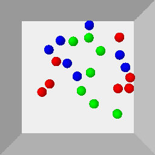

# EbOR
EbOR: environments for Example-based Object Rearrangement

Currently there are three environments in this repo:

| *Circling-v0* | *Clustering-v0* | *CirclingClustering-v0* |
|  ----  | ----  | ----  | 
|  |   |     |

# Install

## Requirements
- Ubuntu >= 18.04
- python >= 3.6
- gym >= 0.26.1
- pybullet >= 3.2.5

## Installation
```
git clone https://github.com/AaronAnima/EbOR

cd EbOR

pip install -e .
```

# Getting Started
```
import gym
import ebor
# import cv2

env = gym.make('CirclingClustering-v0')
x = env.reset() # to init objects

while True:
    done = False
    x = env.reset(is_random=False) # if is_random=False, the env will reset to a target example state

    img = env.render()
    # cv2.imwrite('./target_example.png', img) 

    x = env.reset()
    while not done:
        random_action = env.action_space.sample()
        x, reward, done, truncated, info = env.step(random_action)

        img = env.render()
        # cv2.imwrite('./in_process.png', img)
```
